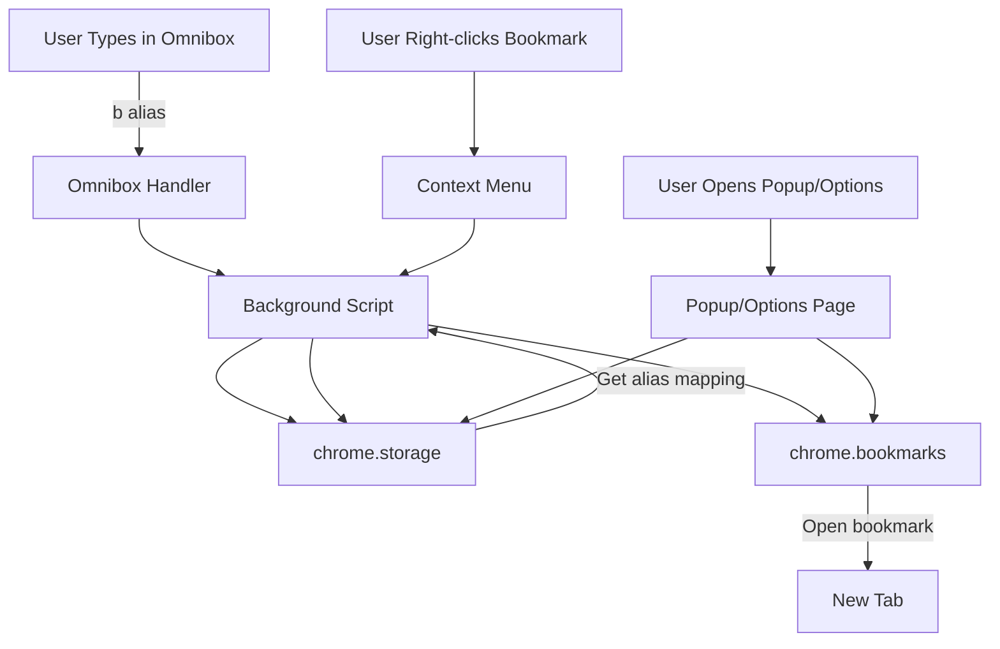

# Chrome Extension: Bookmark Shortcut with Omnibox Aliases

## Overview

A Chrome extension that enables opening bookmarks via custom aliases typed in the omnibox. Users can set aliases through a popup, context menu, or options page.

## Architecture



## File Structure

```
bookmark-shortcut/
├── manifest.json              # Extension manifest
├── background.js              # Background script (omnibox handler)
├── popup/
│   ├── popup.html            # Popup UI
│   ├── popup.js              # Popup logic
│   └── popup.css             # Popup styles
├── options/
│   ├── options.html          # Options page UI
│   ├── options.js            # Options page logic
│   └── options.css           # Options page styles
├── icons/
│   ├── icon16.png            # 16x16 icon (provided by user)
│   ├── icon48.png            # 48x48 icon (provided by user)
│   └── icon128.png           # 128x128 icon (provided by user)
└── readme.md                  # Project documentation
```

## Implementation Details

### 1. manifest.json

- Manifest V3 configuration
- Permissions: `bookmarks`, `storage`, `contextMenus`, `tabs`
- Background service worker
- Omnibox keyword: `b` (user types "b " followed by alias)
- Icons, popup, and options page declarations

### 2. background.js

- **Omnibox handler**: Listens for "b " prefix
  - Provides suggestions as user types alias
  - Navigates to bookmark when alias is selected/entered
- **Context menu**: Creates right-click option on bookmarks
  - "Set alias for this bookmark" option
  - Opens dialog to set/update alias
- **Storage management**: 
  - Stores alias-to-bookmark mapping: `{ alias: bookmarkId }`
  - Handles alias conflicts (warns or overwrites)

### 3. popup/popup.html & popup.js

- Quick interface for managing aliases
- List all bookmarks with their aliases
- Set/update/remove alias for any bookmark
- Search/filter bookmarks
- Open bookmark directly

### 4. options/options.html & options.js

- Full-featured options page
- Same functionality as popup but more space
- Bulk alias management
- Import/export alias mappings
- Settings (prefix customization, case sensitivity, etc.)

### 5. Storage Schema

```javascript
{
  aliases: {
    "alias1": "bookmarkId1",
    "alias2": "bookmarkId2"
  },
  settings: {
    prefix: "b",
    caseSensitive: false
  }
}
```

## Key Chrome APIs Used

- `chrome.omnibox` - Handle omnibox input and suggestions
- `chrome.bookmarks` - Read bookmarks and open them
- `chrome.storage` - Persist alias mappings
- `chrome.contextMenus` - Right-click menu on bookmarks
- `chrome.tabs` - Open bookmarks in tabs

## User Flow

1. **Setting an alias**:

   - Via popup: Click extension icon → select bookmark → set alias
   - Via context menu: Right-click bookmark → "Set alias" → enter alias
   - Via options: Open options page → manage aliases

2. **Using an alias**:

   - Type "b " in omnibox
   - Type alias (suggestions appear)
   - Select or press Enter to open bookmark

## Technical Considerations

- **Alias validation**: Prevent empty/invalid aliases, handle special characters
- **Conflict resolution**: If alias already exists, prompt to overwrite or choose different alias
- **Case sensitivity**: Configurable (default: case-insensitive)
- **Bookmark deletion**: Clean up aliases when bookmarks are deleted
- **Performance**: Efficient storage lookup for omnibox suggestions
- **Error handling**: Graceful handling of deleted bookmarks, invalid IDs

## Implementation Steps

1. Create `manifest.json` with required permissions and structure
2. Implement `background.js` with omnibox handler and context menu
3. Build popup UI and functionality
4. Build options page UI and functionality
5. Implement storage utilities for alias management
6. Add bookmark change listeners to sync aliases
7. Test all three alias management methods
8. Add error handling and edge cases
